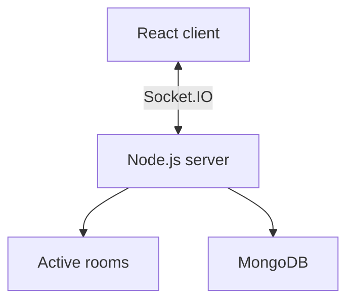

# Monkeytiles

Monkeytiles is a browser-based memory card game built with React, Node.js, Express, Socket.IO, and MongoDB. It supports solo play and real-time multiplayer with synchronized turns, scoring, emotes, and player reconnection.

**Live demo:** https://monkeytiles.js.org

## Features

* Solo and real-time multiplayer gameplay
* Up to four players per room
* 4×4, 6×6, and 8×8 boards
* Multiple card decks
* Server-authoritative multiplayer logic
* Temporary and permanent rooms
* Lifetime scores for permanent rooms (MongoDB)
* Player reconnection support
* In-room emoji reactions
* Responsive desktop and mobile interface

## Tech stack

| Area     | Technology        |
| -------- | ----------------- |
| Frontend | React + Vite      |
| Backend  | Node.js + Express |
| Realtime | Socket.IO         |
| Database | MongoDB           |
| Styling  | CSS               |
| Linting  | Oxlint            |

## Quick start

### Prerequisites

* Git
* Node.js (includes npm)

### Installation

```bash
git clone https://github.com/<your-username>/monkeytiles.git
cd monkeytiles
npm ci
cp .env.example .env
set -a
source .env
set +a
npm run dev
```

MongoDB is optional for solo play and temporary rooms.
The server reads `process.env` but does not automatically load `.env`; the
`set -a`/`source` commands above export its values in macOS and Linux shells.

For full setup instructions, see [docs/development.md](docs/development.md).

## Environment variables

| Variable      | Purpose                                |
| ------------- | -------------------------------------- |
| `PORT`        | Backend port (default: `3001`)         |
| `MONGODB_URI` | MongoDB connection for permanent rooms |
| `NODE_ENV`    | Runtime environment                    |

Never commit `.env` or database credentials.

## Available commands

| Command               | Purpose                      |
| --------------------- | ---------------------------- |
| `npm run dev`         | Start frontend and backend   |
| `npm run client`      | Start the frontend           |
| `npm run server`      | Start the backend            |
| `npm run lint`        | Run Oxlint                   |
| `npm run build`       | Build the frontend           |
| `npm run preview`     | Preview the production build |
| `npm test`            | Run production server tests  |
| `npm run test:legacy` | Run the legacy mock test     |

## Architecture



The React client handles the interface, while the Node.js server manages multiplayer rooms, validates gameplay, and synchronizes state between players. MongoDB is used for permanent rooms and lifetime scores.

For a detailed overview, see [docs/architecture.md](docs/architecture.md).

## Project structure

```text
monkeytiles/
├── public/              Static assets
├── src/                 React frontend
│   ├── App.jsx
│   ├── main.jsx
│   └── index.css
├── docs/                Project documentation
├── tests/               Production integration tests
├── server.js            Backend server
├── server_test.js       Legacy mock-server test
├── package.json
├── vite.config.js
└── render.yaml
```

## Contributing

1. Fork the repository.
2. Create a feature branch.
3. Make your changes.
4. Run the relevant checks.
5. Open a pull request.

See [docs/development.md](docs/development.md) for the full development workflow.

## Project status

The project is currently being documented, tested, and refactored into a more modular architecture while preserving existing behavior.

## License

No license file is currently included. Confirm licensing with the original project owner before redistributing or reusing the code.
