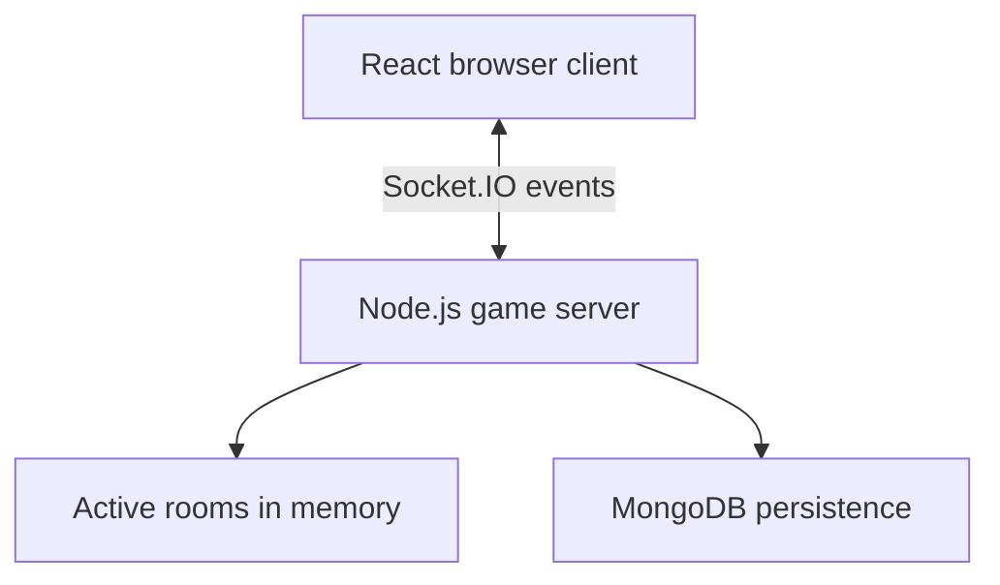
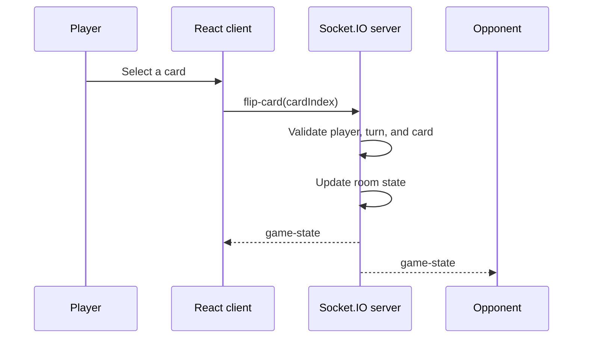

# Monkeytiles Architecture

This document gives a high-level overview of the current Monkeytiles architecture before the planned refactor. It serves as a reference for the existing design so behavior can remain unchanged during the reorganization.

## Overview

Monkeytiles is a browser-based memory card game that supports solo and real-time multiplayer play. The project consists of two applications:

* A React frontend that renders the UI and handles player interaction.
* A Node.js backend that manages multiplayer rooms, validates game actions, and synchronizes state using Socket.IO.



## Entry points

### Frontend

The browser loads `index.html`, which mounts the React application through `src/main.jsx`.

```text
index.html
  -> src/main.jsx
      -> src/App.jsx
          -> src/index.css
```

During development, Vite serves the frontend. Production builds are written to `dist/`.

### Backend

The backend starts from `server.js`, which creates:

* an Express application;
* an HTTP server;
* a Socket.IO server;
* an optional MongoDB connection;
* an in-memory room store.

The server listens on `process.env.PORT`, defaulting to `3001` for local development.

## Frontend

Most frontend logic currently lives in `src/App.jsx`, including:

* game setup (mode, grid size, deck);
* local board generation;
* React state management;
* Socket.IO connection and reconnection;
* sending and receiving multiplayer events;
* rendering the lobby, game board, controls, scores, modals, and emotes.

Global styles are defined in `src/index.css`.

## Backend

Most backend logic currently lives in `server.js`, including:

* room creation and management;
* player joins and reconnects;
* game start and restart;
* move validation;
* match resolution and turn handling;
* winner calculation;
* state broadcasting;
* disconnect handling and room cleanup;
* loading and updating permanent-room scores in MongoDB.

Active rooms are stored in an in-memory `Map`, so ongoing games are lost if the server restarts and cannot be shared across multiple server instances.

## Multiplayer flow

For online games, clients send actions while the server remains the source of truth.



Clients render the state received from the server and may use optimistic UI updates to improve responsiveness.

## Socket.IO events

### Client → Server

* `create-room`
* `join-room`
* `rejoin-room`
* `start-game`
* `flip-card`
* `restart-game`
* `update-room-settings`
* `explicit-leave`
* `send-emote`
* `create-permanent-room`
* `verify-permanent-room`

### Server → Client

* `room-created`
* `permanent-room-created`
* `permanent-room-verified`
* `game-state`
* `player-left`
* `room-closed`
* `receive-emote`
* `error-message`

## Data storage

### In memory

The server keeps active rooms, players, game boards, scores, turns, and reconnection state in memory.

### MongoDB

When `MONGODB_URI` is configured, MongoDB stores permanent rooms and lifetime scores. The application can run without MongoDB, although persistent-room features are unavailable.

Database credentials should never be committed to Git. Store them in an ignored `.env` file and document required variables in `.env.example`.

## Development commands

| Command               | Purpose                                  |
| --------------------- | ---------------------------------------- |
| `npm run client`      | Start the Vite frontend                  |
| `npm run server`      | Start the Node.js backend                |
| `npm run dev`         | Start both frontend and backend          |
| `npm run lint`        | Run Oxlint                               |
| `npm run build`       | Build the frontend                       |
| `npm run preview`     | Preview the production build             |
| `node server_test.js` | Run the existing mock state-machine test |

## Deployment

The frontend is deployed with GitHub Pages, while the backend runs on Render. In production, the React client connects to `https://monkeytiles.onrender.com`.

## Current limitations

* `src/App.jsx` mixes UI, local game logic, socket handling, and rendering.
* `server.js` combines networking, game logic, room management, persistence, and startup.
* Socket event definitions are duplicated between the client and server.
* `server_test.js` uses a simplified server instead of the production implementation.
* Some frontend modes and assets appear unused.

These limitations motivate the upcoming refactor. The goal is to improve the project structure without changing existing behavior.
